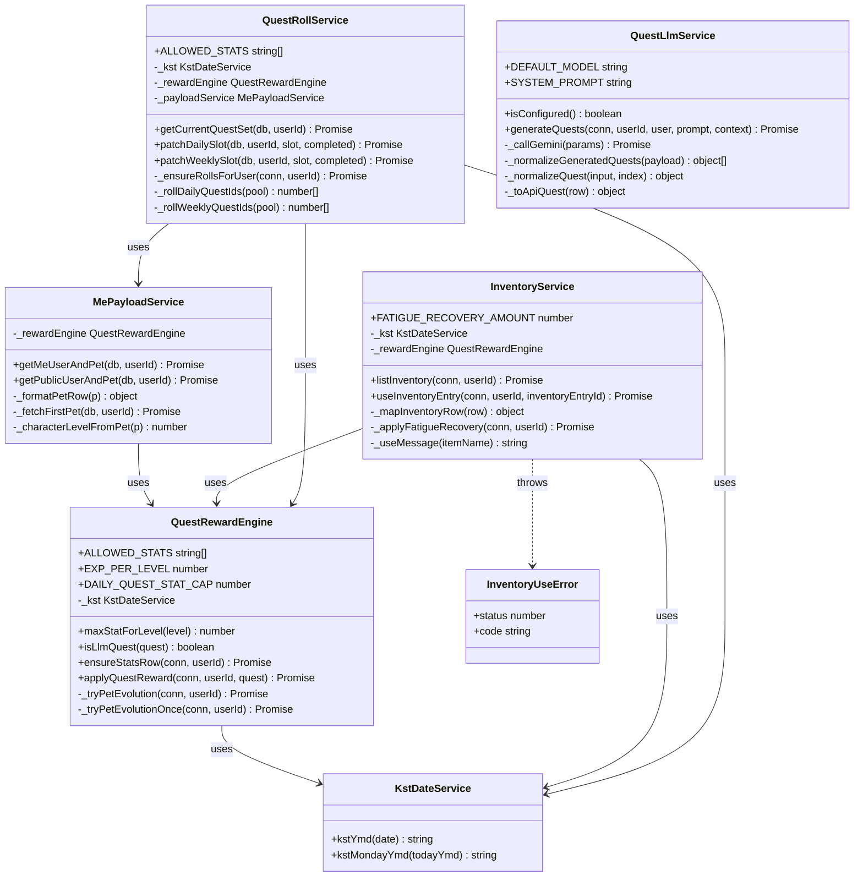

# Class 설계서

| 항목 | 내용 |
|------|------|
| **프로젝트 명** | Campus Life RPG (campusRPG-Backend) |
| **문서 명** | Class 설계서 |
| **버전** | 1.6 |
| **개발 기간** | 2026-05-19 ~ 2026-06-01 |
| **작성일** | 2026-06-01 |

본 문서는 2026년 5월 19일부터 6월 1일까지 진행한 백엔드 게임 로직을 **서비스 클래스** 중심으로 정리한 설계서입니다. Express 라우트(`routes/*.js`)는 HTTP 진입점이며, 퀘스트·보상·인벤·LLM 등 핵심 도메인은 아래 7개 클래스로 구현·확장되었습니다.

---

## 1. 변경 이력

| 날짜 | 버전 | 변경 내용 | 작성자 |
|------|------|-----------|--------|
| 2026-05-19 | 0.1 | **KstDateService** 신규 — KST `kstYmd`·`kstMondayYmd` 도입, 퀘스트·롤 일자 기준 통일 | campusRPG 팀 |
| 2026-05-20 | 0.2 | **QuestRewardEngine** 신규 — EXP 1000 캐리, 일일 스탯 합 70(`quest_daily_stat_sum`), `maxStatForLevel`, 펫 진화(`_tryPetEvolution`) | campusRPG 팀 |
| 2026-05-21 | 0.3 | **MePayloadService** 신규 — `getMeUserAndPet`: `user.level`·`maxStatPerStat`·`stats.dailyFatigue`(퀘스트 일일 합) 스냅샷 | campusRPG 팀 |
| 2026-05-22 | 0.4 | **QuestRollService** 신규 — 일/주간 롤 생성·`getCurrentQuestSet`, `patchDailySlot`/`patchWeeklySlot` 완료 시 `QuestRewardEngine.applyQuestReward` 연동 | campusRPG 팀 |
| 2026-05-23 | 0.5 | **QuestRollService** 확장 — PATCH 응답에 `levelUp`·`evolved`·`MePayloadService` user/pet 병합 | campusRPG 팀 |
| 2026-05-24 | 0.6 | **MePayloadService** 확장 — `getPublicUserAndPet` (친구·본인 공개 프로필, `user.level`·`pet`) | campusRPG 팀 |
| 2026-05-25 | 0.7 | **QuestLlmService** 신규 — Gemini 맞춤 퀘스트 생성·정규화·DB 저장(`for_roll_pool=0`, 코인 0) | campusRPG 팀 |
| 2026-05-26 | 0.8 | **QuestRewardEngine** 확장 — `isLlmQuest` 추가, 맞춤 퀘스트 완료 시 코인 미지급·DB `reward_coin` 0 정규화 | campusRPG 팀 |
| 2026-05-27 | 0.9 | **InventoryService** 신규 — `listInventory` (`user_inventory.id`·`effectType` 포함) | campusRPG 팀 |
| 2026-05-28 | 1.0 | **InventoryService** 확장 — `useInventoryEntry`, **InventoryUseError**, `FATIGUE_RECOVERY` 시 `quest_daily_stat_sum` KST -10 | campusRPG 팀 |
| 2026-05-29 | 1.1 | **InventoryService** — `EXP_BOOST` 등 기타 `effect_type` 수량만 차감(스탯/EXP/코인 변경 없음) 규칙 확정 | campusRPG 팀 |
| 2026-05-30 | 1.2 | **QuestLlmService** — 보상 범위 DAILY EXP 50–100·스탯 5–9, WEEKLY EXP 100–200·스탯 10–20 클램프 | campusRPG 팀 |
| 2026-05-31 | 1.5 | 클래스 간 의존성 정리 — `QuestRollService` → `MePayloadService`·`QuestRewardEngine`·`KstDateService` 생성자 주입 | campusRPG 팀 |
| 2026-06-01 | 1.6 | Class 설계서 확정 — 클래스 다이어그램·명세서·개발 기간(5/19~6/1) 반영 | campusRPG 팀 |

### 1.1 개발 기간 요약 (2026-05-19 ~ 2026-06-01)

| 영역 | 담당 클래스 | API·기능 |
|------|-------------|----------|
| 날짜·KST | `KstDateService` | 퀘스트 일일 합 리셋, 롤 `rollDate`/`weekId` |
| 퀘스트 보상 | `QuestRewardEngine` | 슬롯·레거시·맞춤 완료 보상, 레벨업·펫 진화 |
| 내 정보 | `MePayloadService` | `GET /api/me`, `GET /api/users/:id` 스냅샷 |
| 슬롯 롤 | `QuestRollService` | `GET/PATCH /api/me/quests/*` |
| 맞춤 퀘스트 | `QuestLlmService` | `POST /api/quests/generate`, `GET /api/quests?source=llm` |
| 가방 | `InventoryService` | `GET /api/inventory`, `POST /api/inventory/use` |

---

## 2. 클래스 다이어그램



**관계 요약**

| 관계 | 설명 |
|------|------|
| Dependency (`-->`) | 서비스 생성자 주입 또는 메서드 호출 |
| Association (`..>`) | `InventoryUseError` 예외 발생 |

Express 라우트(`routes/*.js`)는 HTTP 계층으로 클래스화하지 않았으며, 위 서비스 클래스를 호출합니다.

---

## 3. 클래스 명세서

### 3.1 KstDateService

**파일:** `backend/services/kstUtils.js`

```javascript
class KstDateService {
```

#### 속성 (Attributes)

| 가시성 | 이름 | 타입 | 설명 |
|--------|------|------|------|
| — | (인스턴스 필드 없음) | — | 상태 없는 유틸리티 서비스 |

#### 메서드 (Methods)

| 가시성 | 시그니처 | 설명 |
|--------|----------|------|
| + | `kstYmd(d?: Date): string` | KST 기준 오늘 날짜 `YYYY-MM-DD` 반환 |
| + | `kstMondayYmd(todayYmd: string): string` | KST 기준 해당 주 월요일 `YYYY-MM-DD` 반환 |

---

### 3.2 QuestRewardEngine

**파일:** `backend/services/questRewardEngine.js`

```javascript
class QuestRewardEngine {
```

#### 속성 (Attributes)

| 가시성 | 이름 | 타입 | 설명 |
|--------|------|------|------|
| + (static) | `ALLOWED_STATS` | `string[]` | 허용 스탯 종류 5종 |
| + (static) | `EXP_PER_LEVEL` | `number` | 레벨업당 필요 EXP (1000) |
| + (static) | `DAILY_QUEST_STAT_CAP` | `number` | 일일 퀘스트 스탯 합 상한 (70) |
| - | `_kst` | `KstDateService` | KST 날짜 서비스 (의존성) |

#### 메서드 (Methods)

| 가시성 | 시그니처 | 설명 |
|--------|----------|------|
| + | `constructor(kstService?: KstDateService)` | KST 서비스 주입 (기본: 싱글톤) |
| + | `maxStatForLevel(level: number): number` | 펫 레벨별 스탯 상한 계산 |
| + | `isLlmQuest(quest: object): boolean` | 맞춤 퀘스트(`for_roll_pool=0`) 여부 — 완료 시 코인 0 (2026-05-26 설계 반영) |
| + | `ensureStatsRow(conn, userId): Promise<void>` | stats 행 없으면 INSERT |
| + | `applyQuestReward(conn, userId, quest): Promise<object>` | EXP·코인·스탯·레벨업·펫 진화 적용 |
| - | `_tryPetEvolution(conn, userId): Promise<boolean>` | 펫 진화 시도 (최대 2회) |
| - | `_tryPetEvolutionOnce(conn, userId): Promise<boolean>` | 펫 진화 1회 시도 |

---

### 3.3 MePayloadService

**파일:** `backend/services/mePayloadService.js`

```javascript
class MePayloadService {
```

#### 속성 (Attributes)

| 가시성 | 이름 | 타입 | 설명 |
|--------|------|------|------|
| - | `_rewardEngine` | `QuestRewardEngine` | 스탯 상한 계산용 의존성 |

#### 메서드 (Methods)

| 가시성 | 시그니처 | 설명 |
|--------|----------|------|
| + | `constructor(rewardEngine?: QuestRewardEngine)` | 보상 엔진 주입 |
| + | `getMeUserAndPet(db, userId): Promise<object\|null>` | `GET /api/me` 스냅샷 `{ user, pet }` |
| + | `getPublicUserAndPet(db, userId): Promise<object\|null>` | 공개 프로필 스냅샷 (친구·본인, 2026-05-24) |
| - | `_formatPetRow(p): object` | DB pet 행 → API camelCase |
| - | `_fetchFirstPet(db, userId): Promise<object\|null>` | 첫 펫 조회 |
| - | `_characterLevelFromPet(p): number` | 펫 레벨 → 캐릭터 레벨 |

---

### 3.4 InventoryUseError

**파일:** `backend/services/inventoryService.js`

```javascript
class InventoryUseError extends Error {
```

#### 속성 (Attributes)

| 가시성 | 이름 | 타입 | 설명 |
|--------|------|------|------|
| + | `status` | `number` | HTTP 상태 코드 (404, 409 등) |
| + | `code` | `string` | API 에러 코드 (`INVENTORY_ENTRY_NOT_FOUND` 등) |

#### 메서드 (Methods)

| 가시성 | 시그니처 | 설명 |
|--------|----------|------|
| + | `constructor(status, error, message?)` | 예외 객체 생성 |

---

### 3.5 InventoryService

**파일:** `backend/services/inventoryService.js`

```javascript
class InventoryService {
```

#### 속성 (Attributes)

| 가시성 | 이름 | 타입 | 설명 |
|--------|------|------|------|
| + (static) | `FATIGUE_RECOVERY_AMOUNT` | `number` | 에너지 드링크 피로도 회복량 (10) |
| + (static) | `NO_STAT_EFFECT_TYPES` | `Set<string>` | 수량만 차감하는 effect_type 집합 |
| - | `_kst` | `KstDateService` | KST 날짜 서비스 |
| - | `_rewardEngine` | `QuestRewardEngine` | stats 행 보장용 |

#### 메서드 (Methods)

| 가시성 | 시그니처 | 설명 |
|--------|----------|------|
| + | `constructor(kstService?, rewardEngine?)` | 의존성 주입 |
| + | `listInventory(conn, userId): Promise<object[]>` | 가방 목록 (`user_inventory.id` 포함) |
| + | `useInventoryEntry(conn, userId, inventoryEntryId): Promise<object>` | 아이템 1개 사용·효과 적용 |
| - | `_mapInventoryRow(row): object` | DB JOIN 행 → API 객체 |
| - | `_applyFatigueRecovery(conn, userId): Promise<number>` | `quest_daily_stat_sum` 감소, delta 반환 |
| - | `_useMessage(itemName): string` | 한국어 사용 완료 메시지 |

---

### 3.6 QuestRollService

**파일:** `backend/services/questRollService.js`

```javascript
class QuestRollService {
```

#### 속성 (Attributes)

| 가시성 | 이름 | 타입 | 설명 |
|--------|------|------|------|
| + (static) | `ALLOWED_STATS` | `string[]` | 롤 풀 스탯 5종 |
| - | `_kst` | `KstDateService` | 일/주 롤 날짜 |
| - | `_rewardEngine` | `QuestRewardEngine` | 슬롯 완료 보상 |
| - | `_payloadService` | `MePayloadService` | PATCH 후 user/pet 스냅샷 |

#### 메서드 (Methods)

| 가시성 | 시그니처 | 설명 |
|--------|----------|------|
| + | `constructor(kstService?, rewardEngine?, payloadService?)` | 의존성 주입 |
| + | `getCurrentQuestSet(db, userId): Promise<object>` | 일/주간 롤 + 퀘스트 목록 |
| + | `patchDailySlot(db, userId, slot, completed): Promise<object>` | 일일 슬롯 완료/해제 + 보상 |
| + | `patchWeeklySlot(db, userId, slot, completed): Promise<object>` | 주간 슬롯 완료/해제 + 보상 |
| - | `_ensureRollsForUser(conn, userId): Promise<object>` | KST 기준 롤 없으면 생성 |
| - | `_rollDailyQuestIds(pool): number[]` | 스탯별 5개 일일 퀘스트 ID |
| - | `_rollWeeklyQuestIds(pool): number[]` | 랜덤 3스탯 주간 퀘스트 ID |

---

### 3.7 QuestLlmService

**파일:** `backend/services/questLlmService.js`

```javascript
class QuestLlmService {
```

#### 속성 (Attributes)

| 가시성 | 이름 | 타입 | 설명 |
|--------|------|------|------|
| + (static) | `DEFAULT_MODEL` | `string` | Gemini 기본 모델명 |
| + (static) | `SYSTEM_PROMPT` | `string` | LLM 시스템 프롬프트 |
| + (static) | `REWARD_RANGES` | `object` | DAILY/WEEKLY EXP·스탯 범위 |

#### 메서드 (Methods)

| 가시성 | 시그니처 | 설명 |
|--------|----------|------|
| + | `isConfigured(): boolean` | `GEMINI_API_KEY` 설정 여부 |
| + | `generateQuests(conn, userId, user, prompt, context): Promise<object>` | Gemini 호출 → DB 저장 → API 퀘스트 배열 |
| - | `_callGemini(params): Promise<object>` | Gemini REST API 호출 |
| - | `_normalizeGeneratedQuests(payload): object[]` | LLM JSON 검증·클램프 |
| - | `_normalizeQuest(input, index): object` | 단일 퀘스트 정규화 |
| - | `_toApiQuest(row): object` | DB 행 → API 응답 객체 |

---

## 4. API 연동 및 프론트엔드

| 항목 | 내용 |
|------|------|
| REST API | `CLASS_DESIGN` 클래스는 `routes/*.js`에서 싱글톤 인스턴스를 호출 |
| 프론트 변경 | API URL·JSON 계약 동일 — **프론트 수정 불필요** |
| 인증 | 인벤·구매·사용·퀘스트·`/api/me` 등 `Authorization: Bearer <JWT>` |

주요 연동 API (개발 기간 내 구현):

- `GET /api/me` → `MePayloadService.getMeUserAndPet`
- `GET/PATCH /api/me/quests/*` → `QuestRollService`
- `POST /api/quests/generate`, `GET /api/quests?source=llm` → `QuestLlmService` + `QuestRewardEngine`(완료)
- `GET /api/inventory`, `POST /api/inventory/use` → `InventoryService`
- `GET /api/users/:id` → `MePayloadService.getPublicUserAndPet`

---

## 5. 파일 ↔ 클래스 매핑

| 클래스 | 파일 |
|--------|------|
| `KstDateService` | `backend/services/kstUtils.js` |
| `QuestRewardEngine` | `backend/services/questRewardEngine.js` |
| `MePayloadService` | `backend/services/mePayloadService.js` |
| `InventoryService`, `InventoryUseError` | `backend/services/inventoryService.js` |
| `QuestRollService` | `backend/services/questRollService.js` |
| `QuestLlmService` | `backend/services/questLlmService.js` |
